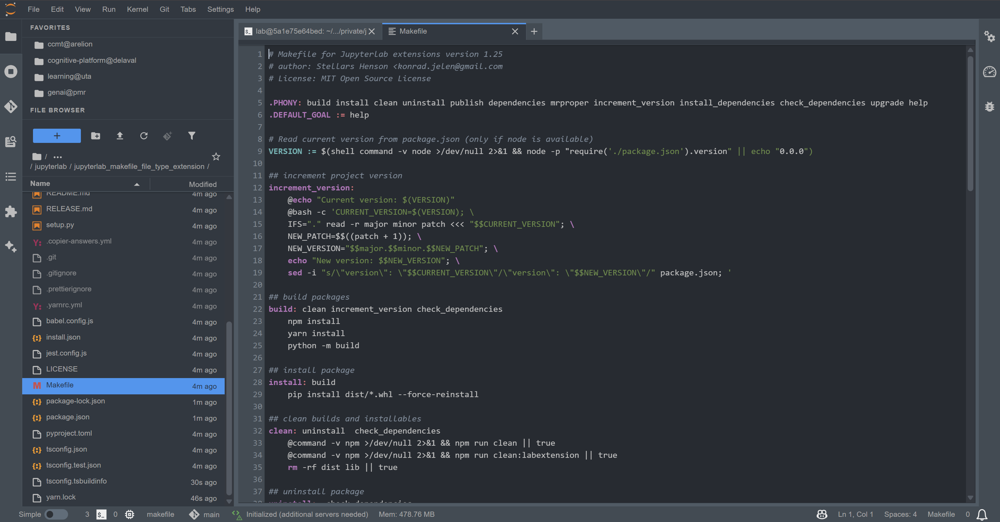

# jupyterlab_makefile_file_type_extension

[](https://github.com/stellarshenson/jupyterlab_makefile_file_type_extension/actions/workflows/build.yml)
[](https://www.npmjs.com/package/jupyterlab_makefile_file_type_extension)
[](https://pypi.org/project/jupyterlab-makefile-file-type-extension/)
[](https://pepy.tech/project/jupyterlab-makefile-file-type-extension)
[](https://jupyterlab.readthedocs.io/en/stable/)
[](https://kolomolo.com)

A JupyterLab extension providing comprehensive Makefile support with syntax highlighting and custom file type recognition.



## Features

Comprehensive Makefile editing support in JupyterLab with syntax highlighting that distinguishes targets, variables, conditionals, and shell constructs.

**File recognition**:
- Standard names: `Makefile`, `makefile`, `GNUmakefile`
- Extensions: `*.mk`, `*.mak`, `*.make`
- Custom red "M" icon in file browser

**Highlighting coverage**:
- Build targets and dependencies
- Variable references and shell constructs
- Conditional directives
- Special targets and silent commands
- Line continuations and quoted strings

## Requirements

- JupyterLab >= 4.0.0

## Install

To install the extension, execute:

```bash
pip install jupyterlab_makefile_file_type_extension
```

## Configuration

**IMPORTANT: Configure Tab Character Usage**

Makefiles require tab characters for recipe command indentation. Recipe lines starting with spaces instead of tabs will cause Make execution to fail with "missing separator" errors. Configure JupyterLab to use tabs:

1. Open JupyterLab Settings → Settings Editor
2. Navigate to **Text Editor** section
3. Set **Indentation Unit** to `Tab`

Alternatively, add this to your JupyterLab Text Editor settings JSON:

```json
{
  "editorConfig": {
    "indentUnit": "Tab",
    "tabSize": 4
  }
}
```

**Note**: All recipe commands (lines that execute shell commands under targets) MUST start with a tab character. The syntax highlighter requires tab-indented recipe lines for proper highlighting - space-indented recipes will not be highlighted and will fail during Make execution.
